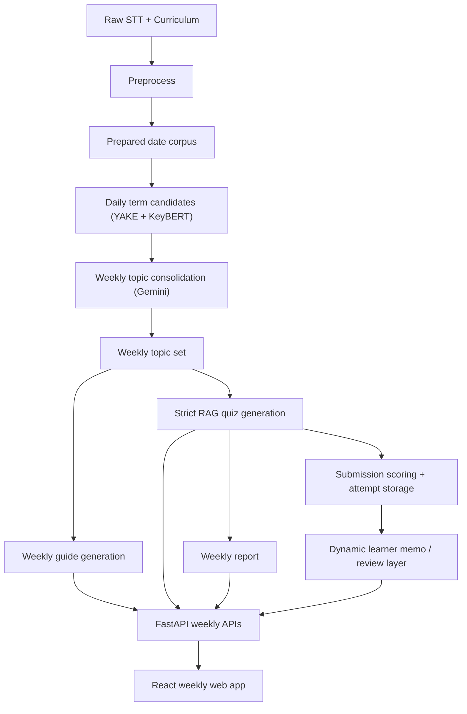

# Architecture

## Goal

전처리된 STT와 커리큘럼을 바탕으로 `weekly bundle`을 생성하고, 이를 API와 프론트 web app으로 제공한다.

현재 기준 bundle 구성:
- `weekly topic set`
- `weekly guide`
- `weekly quiz`
- `weekly report`

## Current canonical architecture

## Key decisions

### Data and storage
- 저장소 기본값은 `PostgreSQL + pgvector`
- prepared corpus 저장 단위는 `date`
- daily corpus는 intermediate artifact
- 사용자-facing 기본 단위는 `week`

### Topic extraction
- daily supporting term 후보 추출은 `YAKE + KeyBERT`
- weekly topic axis 통합은 `Gemini`
- current accepted baseline에서는 upstream을 다시 돌리지 않고 seed를 재사용

### Weekly guide
- topic axis 기반으로 생성
- `4~5줄 한 문단` 요약 + review points

### Weekly quiz
- 현재 기준은 `LangChain strict RAG`
- solve용 `GET /weekly-quiz/{week_id}`는 learner-facing payload이며 answer key를 직접 노출하지 않는다
- 제출은 `POST /weekly-quiz/{week_id}/submit`로 처리한다
- submit은 전 문항 응답 전에는 `422`로 거부된다
- submit 응답은 `attempt_id`, `submitted_at`, `total_questions`, `correct_count`, `score`, `results`, `learner_memo`를 포함한다
- 제출 후 review 조회는 아래 두 endpoint를 사용한다
  - `GET /weekly-quiz/{week_id}/latest-submission`
  - `GET /weekly-quiz/{week_id}/attempts/{attempt_id}`
- retrieval용 chunk는 기존 sentence-pack chunk를 재사용하지 않음
- source는 `preprocessed STT`
- chunking:
  - `RecursiveCharacterTextSplitter`
  - `chunk_size=800`
  - `chunk_overlap=100`
- embeddings:
  - `OpenAIEmbeddings(text-embedding-3-small)`
- retrieval:
  - `pgvector cosine similarity`
  - corpus-restricted dense retrieval
- generation flow:
  - retrieval
  - claim extraction
  - question planning
  - item generation
  - validation

### Quiz contract
- 표시 단위는 weekly
- 생성 계약은 `STT 1개당 최소 5문항`
- 즉 week 내 corpus가 `N`개면 총 문항 수는 최소 `N * 5`

### Weekly report
- 현재 report는 **정적 coverage report + 최신 제출 기반 learner memo + 오답 리뷰** 조합이다
- `GET /weekly-report/{week_id}`는 정적 `WeeklyReport` 필드에 dynamic `learner_memo`를 추가한 response를 반환한다
- `learner_memo`는 static accepted artifact를 수정하지 않고 latest submission을 읽어 runtime layer로 계산된다
- 정적 집계 축:
  - question profile mix
  - topic coverage
  - mismatch counts
  - learning goal source distribution
- 동적 층:
  - latest submission
  - learner memo
  - wrong-answer review

### Frontend
- 현재 학생용 표면은 `frontend/` React web app
- 화면:
  - hub
  - quiz
  - report
- hub는 병합된 weekly core 섹션과 3개 sidebar nav를 사용
- quiz는 submit/score/review까지 동작하고, solve-time `source_date`는 숨긴다
- report는 static coverage + dynamic learner memo + latest wrong-answer review를 함께 보여준다
- submit 직후 provider cache가 `latestSubmission`과 `learnerMemo`를 즉시 갱신한다
- 장기 learner performance analytics는 backlog

## Current APIs

### Serve
- `GET /health`
- `GET /weeks`
- `GET /weekly-topics/{week_id}`
- `GET /weekly-guide/{week_id}`
- `GET /weekly-quiz/{week_id}`
- `POST /weekly-quiz/{week_id}/submit`
- `GET /weekly-quiz/{week_id}/latest-submission`
- `GET /weekly-quiz/{week_id}/attempts/{attempt_id}`
- `GET /weekly-report/{week_id}`
- `GET /weekly-bundle/{week_id}`

현재 contract 요약:
- `GET /weekly-quiz/{week_id}`는 learner-facing payload만 반환한다
- `POST /weekly-quiz/{week_id}/submit`은 partial submit을 허용하지 않는다
- `GET /weekly-report/{week_id}`는 static coverage report + dynamic learner_memo를 함께 반환한다
- `/weekly-bundle/{week_id}`의 `report`는 여전히 static artifact 등가층이다

### Pipeline
- `POST /pipeline/prepare`
- `POST /pipeline/index`
- `POST /pipeline/extract-term-candidates`
- `POST /pipeline/build-weekly-topics`
- `POST /pipeline/generate-weekly-guides`
- `POST /pipeline/generate-weekly-quizzes`

## Current baseline status

Accepted baseline은 `week 1 seeded baseline`이다.

Seed:
- `artifacts/runpod_fetch/gpu_backup_20260317/daily_term_candidates_export.jsonl`
- `artifacts/runpod_fetch/gpu_backup_20260317/weekly_1_topic_set.json`

현재 acceptance:
- quiz `25문항`
- corpus별 `5문항`
- source/retrieved/evidence mismatch `0`
- topic/source mismatch `0`
- guide evidence `5일 전체 커버`
- report mismatch `0`

상세 상태는 `docs/local_week1_baseline_progress.md`를 따른다.

## Out of current scope

아래는 현재 architecture 기준 backlog다.

- multi-attempt learner performance analytics
- 장기 learner profile/history
- concept map 고도화
- week 2+ 확장 acceptance 자동화
